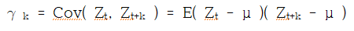
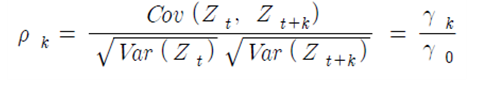
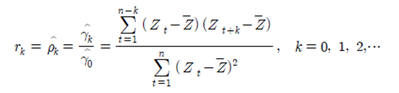
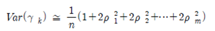
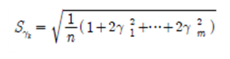
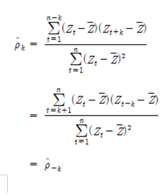

# 3. 자기공분산함수와 자기상관함수(ACF)

정상과정 { Zt }는 모든 t에 대해서 일정한 평균 E( Zt ) = μ과 분산 Var( Zt ) = E( Zt-μ)2 = σt2을 가지며, 단지 공분산 Cov( Zt, Zt+k )은 시차 k의 함수가 된다. 즉 Zt와 Zt+k의 공분산(covariance)은 다음과 같다.
   
한편 Zt 와 Zt+k 의 상관함수(correlation function)는 다음과 같이 정의된다.   
   
여기서 Var( Zt ) = Var( Zt+k ) = γ0 이고, γk는 k 의 함수이므로 자기공분산 함수(Autocovariance function)라 하고, ρk는 자기상관함수(Autocorrelation function : ACF)라 한다. 자기공분산함수(Autocovariance function)와 자기상관함수(ACF)는 단지 k시차로 분리된, 같은 과정에서의 Zt와 Zt+k 사이의 공분산함수와 상관함수를 나타낸다.
정상과정에서 자기공분산함수 γk 와 자기상관함수 ρk 는 임의의 시차 k에 대하여 다음과 같은 성질을 갖고 있다.
1. γ 0 = Var( Zt ) ; ρ 0 = 1
2. |γ k| ≤ γ 0 ; |ρ k| ≤ 1
3. 모든 k에 대하여 γ k = γ -k , ρ k = ρ -k 즉 γ k 와 ρ k 는 k=0인 최초시점에서     대칭인 대칭함수이다.

Box-Jenkins 모형을 이용한 시계열 분석은 자기상관함수로 시계열의 특성을 파악하게 된다. 그러나 실제로 모집단의 자기상관함수를 알 수 없으므로 관찰된 자료로부터 추정해야 하는데, 이 추정량을 표본자기상관함수(sample autoco – rrelation function : SACF)라 하고 다음과 같이 정의한다.   
   
시차 k에 대한 ρˆk 의 그래프를 표본상관도(sample correlogram)라고 하며, 이것은 시계열의 특성을 차악하고 모형을 식별하는데 유용하게 쓰인다. 또한 n이 큰 경우 rk는 근사적으로 평균 ρk를 갖는다.
이때 rk는 n이 크고 평균 ρk=0 인 경우(단, k>m)에는 분산이 다음과 같은 정규분포에 근사한다.   
   
따라서 rk의 표준오차(standard error)의 추정은 다음과 같이 할 수 있다.
또한,
   
   
이므로 표본자기상관함수 는 k = 0을 중심으로 대칭이 된다.