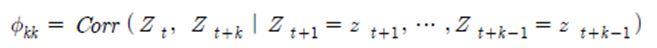
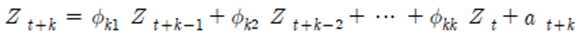
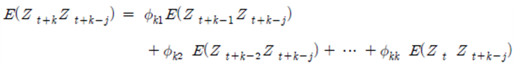
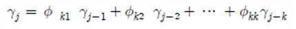
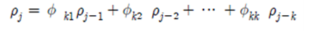
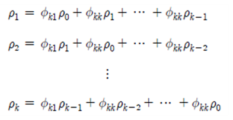
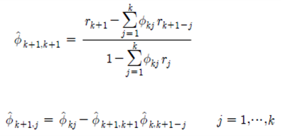
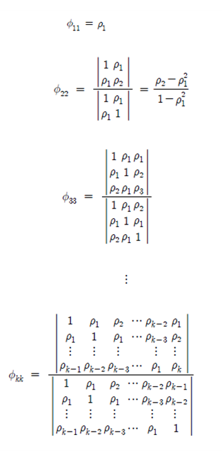

# 4. 편자기상관함수(PACF)

편자기상관함수(partical autocorrelation function : PACF)는 Zt와 Zt+k 의 자기상관함수와 더불어 모형식별에 중요한 또 하나의 개념이다.   부분자기상관함수라고도 하며, 임의의 시차 k에 대하여 Zt와 Zt+k 의 상관관계에서 그것들 사이에 끼어있는 Zt,  Zt+1, Zt+2, … , Zt+k-1의 상호 선형 의존성을 제거한 후의 Zt와 Zt+k 만의 자기상관함수로 다음과 같은 조건부자기상관함수로 표현된다.   
   
이와 같은 편가지상관함수 ∅kk는 시차 k의 함수이며 다음과 같은 회귀 모형을 고려하여 얻을 수 있다.   
   
여기서 ∅kk는 j번째 회귀계수이고 at+k는 정규 오차항으로 Zt+k-j, j ≥ 1 와 상관되지 않는다.   편자기상관함수 ∅kk를 얻기 위하여 위의 식의 양변에 Zt+k-j를 곱하고 기댓값을 취해주면 아래의 자기공분산함수 식을 얻는다.   
   
혹은,   
   
여기서 분산 γ0를 양변에 나누어주면 다음과 같은 자기상관함수의 식을 얻을 수 있다.   
   
여기서 j = 1, 2, …, k로부터 자기상관함수들의 방정식을 다음과 같이 구할 수 있는데 이를 Yule-Walker 방정식이라 한다.   
   
그리고 Cramer의 해법을 k = 1, 2,… 에 반복적으로 적용하면 다음 장의 우측 식과 같은 편자기상관함수 ∅kk를 얻을 수 있고 이것은 모형식별을 하는데 중요한 역할을 하게 된다.   
표본 편자기상관함수(sample partical autocorrelation function : SPACF) ∅ˆkk는   
위의 Yule-Walker 방정식에서 ρ i 대신에 ρˆi를 대체하면서 구한다.   편자기상관함수에서 시차 k가 크면 복잡한 행렬식을 계산하는 대신 다음과 같은 Durbin-Levinson의 알고리즘을 이용한 축소모형을 사용한다.   
   
귀무가설이 ∅kk=0인 경우에는 ∅ˆkk의 분산은 근사적으로 Var(∅ˆkk) ≅ 1/n 과 같이 된다.   
따라서 ∅kk=0 의 가설을 검정할 때 95% 신뢰구간은 ∅ˆkk ± 1.96을 사용할 수 있다.   
   
