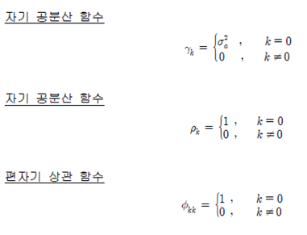
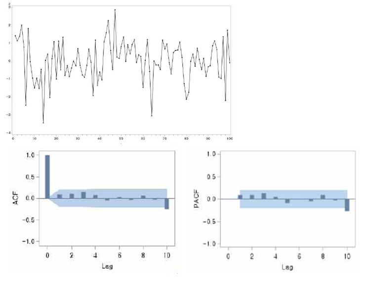

# 백색잡음과정(White noise process)

확률과정 {at, t = 0, ±1, ±2, … } 들이 서로 독립이고 동일한 분포를 가지며,   평균 E(at) = γa(일반적으로 0으로 가정)와   분산 Var(at) = γ2a,   그리고 0 이 아닌 모든 k에 대하여    공분산  γ k = Cov( at, at+k) = 0   을 가질 때 이를 백색잡음과정(white noise process)라고 한다.    정의에 의해서 백색잡음 { at }는 평균과 분산, 공분산이 시간에 의존하지 않으므로 정상성을 갖는다.    백색잡음의 자기공분산 함수 및 ACF 그리고 PACF는 다음과 같다.   
   
시차가 0인 경우 ACF와 PACF는   
ρ0 = ∅00 = 1   이고 일반적으로 ACF와 PACF를 정의할 때 ρk 와 ∅kk 로 사용한다.   
백색잡음과정의 기본적 현상은 k ≠ 0 인 경우 ACF 와 PACF가 동일하게 0이라는 것이다.   
백색잡음과정은 어떤 이론적인 전개를 목적으로 한 수리적 모형으로서 시계열 모형의 성립에 매우 중요한 기본적인 역할을 한다.      
R을 사용하여 백색잡음과정(white noise process)을 생성하여 산포도와 ACF, PACF의 그래프를 나타내어보면 다음과 같음을 알 수 있다.   
   