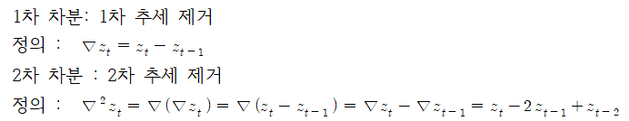

# 차분(Differencing)에 의한 평균 정상화

추세를 갖는 시계열자료는 대부분 차분법에 의해 정상화 시킬 수 있다.   
   
일반적으로 d차 추세를 갖는 시계열자료는 d차 차분을 통해 평균을 균등하게 할 수 있다.    그라나 d차 차분을 하면 자료의 수가 d개 줄어들기 때문에 지나친 차분은 원 자료의 특성을 잃게 하여 추정치의 효율을 떨어뜨리며, 과대추정을 하게 만들 가능성이 있다.   