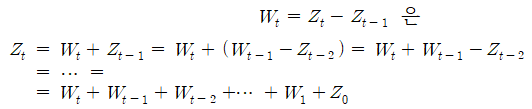

# ARIMA(AR Integrated MA) 모형

비정상 과정   
   
를 ARIMA(p,d,q) 모형이라 한다.   
여기서 차분 차수 d는 시계열자료 z1,...,zT 가 주어졌을 때, 순차도표와 ACF의 패턴을 보고 쉽게 결정할 수 있다.    이 차수 d의 결정은 p, q의 결정에 앞서서 이루어지는 것이 바람직하다.   
추세를 갖는 비정상 과정의 정상화를 차분 연산을 통해 하였는데,    “integration(누적)”이라는 용어를 사용한 이유는 1차 차분을 예로 들어보면   
   
와 같이 표현된다. 결국 비정상 과정 는 정상과정 들의 누적으로 표현된다는 의미를 가지고 있다.   
결론적으로 추세성이 있는가를 시계열 그래프와 표본 ACF를 이용해 차수 d결정을 통해 결정한 후 등분산성 변환이 필요한가를 확인하고, 있다면 추세성과 이분산성 제거 후 표본 ACF와 PACF를 통해 차수 p와 q를 결정한다.