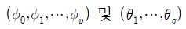
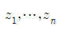

# 식별된 모형의 추정(Estimation)

ARIMA(p,d,q)의 모형식별이 결정되면, 이 모형의 계수   
   
를 시계열 자료   
   
를 이용하여 추정하여야 한다.    
추정 방법에는   
1. ULS(Unconditional Least Squared Method)
2. CLS(Conditional Least Squared Method)
3. ML(Maximum Likelihood Method)
이렇게 세 가지가 있다.   
