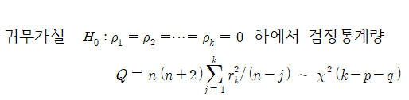

# 모형 검진(Model Diagnoise)

   
이 거의 백색잡음의 성질을 나타내야 할 것이다.   이러한 이유로 보통 2 가지 방법으로 잔차를 검토하게 된다.   
① ACF 검토 : 전차계열이 백색잡음과정의 계열이라면, 귀무가설 의 채택역(유의수준 5%) 내에 모두 속하는 ACF 패턴을 나타내게 될 것이다.   
② 포트맨토 검정(Pormanteau Test) : Box-Ljung 검정   
   
을 사용하여 검정하는 방법이다.