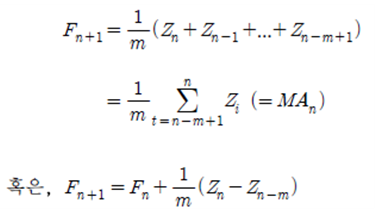

# 이동평균 평활법

첫째로 단순이동평균법(Simple Moving Average Method)에 의한 시계열 평활방법은 수평적 계열(horizontal series), 즉 시간의 경과에 따라 평균수준이 변하지 않는 계열에 적용되며, 가장 최근의 m-기간 동안의 자료들의 단순평균을 다음 기간의 예측값으로 추정하는 방법이다.    이 때 m은 분석자에 의하여 사전적으로 결정되어야 하고, 또 시게열의 새로운 관측값이 추가되면 단순이동평균은 달라진다.   
Zt를 시점 t에서의 실제값이라고 하고, Fn+1을 시점 n에서 추정한 시점 n+1의 예측값이라고 하면 단순이동평균법으로 Fn+1을 구하는 계산식은 다음과 같이 나타난다.   
   

즉 현재 시점이 n인 경우에 다음 시점의 예측값은 최근의 M-기간 동안의 이동평균(MAn)으로 예측하는 방법이 된다.    여기서 만양 m = n 이면 Fn+1은 n-기간 전체의 평균이 되고, m = 1 이면 Fn+1 =  Zt이 된다.    이때 이동평균기간 m은 관측기간 내에서의 한 기간후의 예측오차(one-step-ahead forecast errors)의 평균제곱합을 최소로 하는 값으로 결정할 수 있다.   
   
둘째로 선형이동평균법(Linear Moving Average)은 관측된 시계열이 선형 추세성을 갖는 경우에 적합시킬 수 있는 평활법인 선형이동평균 방법으로, 이를 이용하여 현재 시점이 n인 경우에 n+l 시점의 값을 다음과 같이 예측하는 방법이다.   
   
여기서 MAn는 이동평균을, MA’n은 이중이동평균을 나타낸다.    이중이동평균이란 원계열의 이동평균을 다시 이동평균한 것으로 다음과 같이 정의된다.   
   
