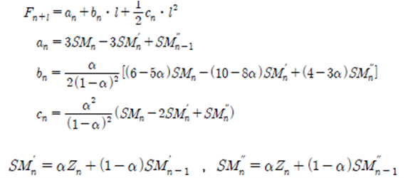

# 지수평활법

첫째로, 단순지수평활법(Simple Exponential Smoothing Method)는 단순이동평균법과 마찬가지로 수평적 시계열 자료에 적용된다.    하지만 단순이동평균법과는 다르게 최근의 자료들에 대해 더 많은 가중치를 부여하는 방법으로 단순이동평균법에서는 이동평균을 계산하기 위해 최근의 m-기간의 관측값만 사용하고, 이 관측값을에 대해서 동일한 가중치를 부여하였으나 단순지수평활법에서는 이러한 단점을 보안한 방법으로 예측식은 다음과 같다.   
   
여기서 a는 평활상수(smoothing constant)라고 하고, 0과 1 사이의 값을 가지며, SMn은 시점 n에서의 평활값(smoothed value)이라고 한다.    그러므로 단순지수평활법이란 시계열 관측값들에 대한 가중평균인 평활값으로 미래의 관측값을 예측하는 방법이라고 할 수 있으며 다음과 같은 식으로 간략하게 나타낼 수 있다.   
   
여기서 F(n-1)+1 는 시점 n-1에서 예측한 시점 n의 예측값을 의미하고, 시점 n에서의 예측오차는 En = Zn – Fn이 된다.    따라서 a, Zn, Fn이 주어지면 Fn+1이 계산될 수 있다.   
지수평활법에 의한 예측에서는 관측값들에 대한 가중치의 역할을 하는 평활상수 a의 결정이 매우 중요한 문제가 된다.    일반적으로 시계열 자료가 안정적이고 변동이 완만한 자료에서는 작은 값의 a가, 그리고 변동이 심한 자료에서는 큰 값의 a가 적절하게 된다.    적절한 a의 결정은 단순이동평균법에서의 m의 결정방법과 마찬가지로 다음과 같은 예측오차의 제곱합을 최소로 하는 a로 결정하면 된다.   
   
둘째로, 선형지수평활법(Linear Exponential Smoothing Method)이란 추세성을 갖는 시계열의 예측을 위한 지수평활법이다.    앞의 선형이동평균법은 단순이동평균법이 갖고 있는 단점들을 거의 그대로 갖고 있지만, 선형지수평활법은 이 문제들을 개선시키기 위한 방법으로 브라운(Brown, 1963)과 홀트(Hollt, 1957)의 두가지 방법이 있다.   
브라운의 선형지수평활법은 지수평활값과 이중지수평활값(double exponential smoothed value)을 이용하여 미래의 값을 예측하는 방법으로 다음과 같고,   
   
홀트의 두 모수 선형지수평활법은 이중지수평활값을 사용하지 않는다는 것을 제외하고는 브라운의 방법과 유사하며, 홀트의 모형에서는 추세를 먼저 추정하여 그것을 이용하여 예측하는 방법으로 다음과 같이 3개의 방정식과 2개의 평활상수(0<α, β<1)가 포함된다.   
   
여기서 SMn은 자료의 평활(smoothing of data), Tn은 추세의 평활(smoothing of trend)을 나타낸다.    하지만 홀트의 방법에서는 2개의 상수를 사전에 결정해야 하는 복잡한 계산과정을 거쳐야한다.    물론 이 경우에도 상수 α, β는 평균제곱예측오차를 최소로 하는 값으로 결정할 수 있다.   
실제 계산에서는 초기값 SM1, T1은 다음과 같은 값으로 사용할 수 있다.   
   
마지막으로 브라운에 의해 제안된 이차지수평활법이 있는데, 이는 시계열이 이차곡선 형태의 추세를 갖는 경우에 적용하며, 이 경우에 이차추세는 삼중지수평활값(triple exponential smoothed value : SMn)을 사용하여 평활한다.    브라운의이차지수평활 예측식은 다음과 같이 한 개의 평활상수 α와 4개의 방정식으로 구성된다.   
    
이차평활을 위한 방정식들은 단순평활이나 선형평활 보다 훨씬 더 복잡하지만 그 원리는 모두 동일하다.