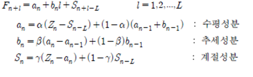
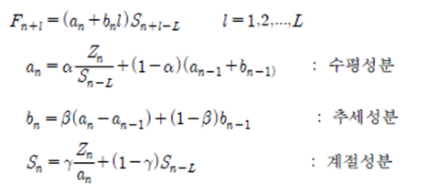

# 계절지수평활법

대부분의 원별 혹은 분기별 자료들은 계절변동을 포함하기 때문에 이러한 시계열 자료들을 예측할 때에는 계절변동을 고려할 수 있는 계절지수평활법을 사용하여야 한다.    계절변동에는 가법적 계절 변동(additive seasonal variation)과 승법적 계절변동(multiplicative seasonal variation)의 두가지 형태가 있으며, 이 두 게절변동의 형태에 따라 서로 다른 예측방법이 적용된다.   
1. 첫째로 가법적 계절지수평활법(Additive Seasonal Exponential Smoothing Method)은 시계열의 계절적 진폭이 시간의 흐름에 따라 일정한 가법적 계절변동을 예측할 수 있으며 현재 시점이 n인 경우에 시점 후의 l시점 후의 예측값은 다음과 같이 나타난다.   
   
2. 둘째로 승법적 계절지수평활법(Multiplicative Seasonal Exponential Smoothing Method)은 시계열의 진폭이 점차적으로 증가 혹은 감소하게 되는 승법적 계절변동을 예측하는데 사용되며, 다음과 같이 시게열 패턴의 세가지 성분인 수평성, 추세성, 계절성을 평활하는 세 개의 방정식과 에측식으로 구성된다.   
