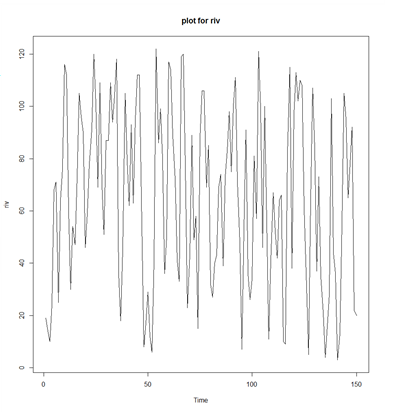
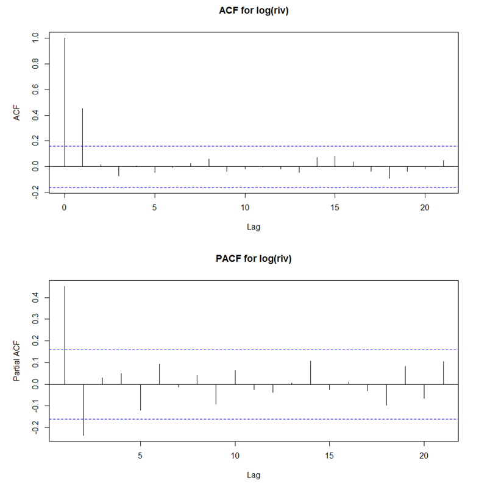
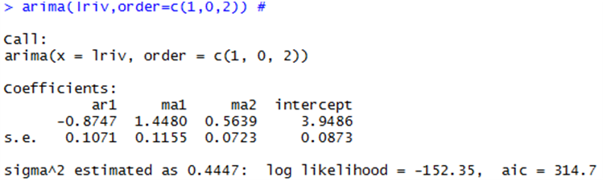
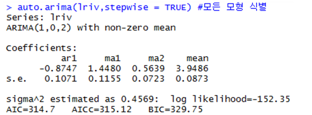
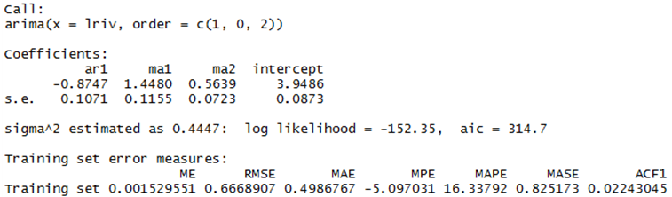
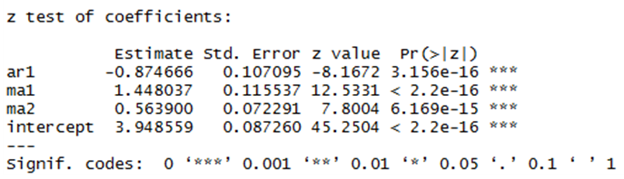
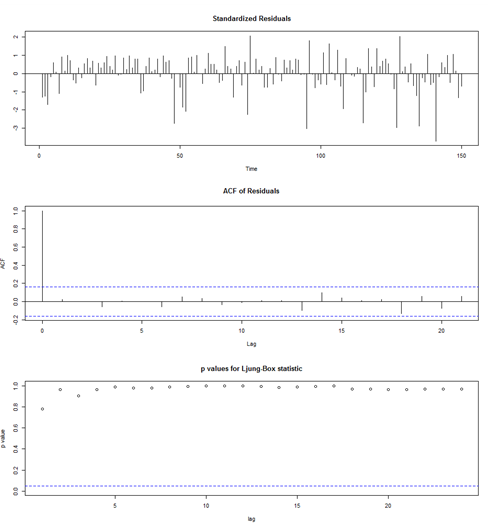
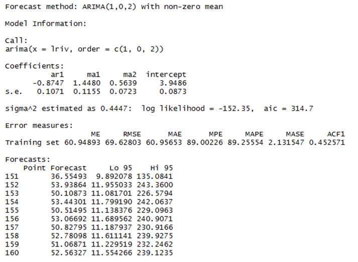
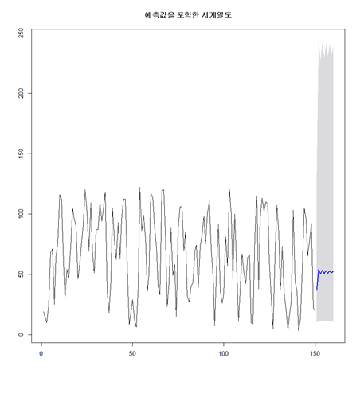

# ARIMA model

## 준비
```r
library(forecast) #auto.arima
library(lmtest) #coeftest
riv <- read.csv("C:/Users/CBNU/Desktop/gota-river-near-sjotopvannersbur.csv",header=T)
riv <- riv[,2]
riv <- riv[-151]
riv <- riv[-151]
riv <- ts(riv) # time series data 시계열 data로 변환
plot.ts(riv,main="plot for riv")
```

- 평균과 분산이 일정하지 않아 로그변환이 필요.
- 계절성은 없는 것으로 판단.
```r
lriv <- log(riv)
plot.ts(lriv,main="plot for log(riv)")
```
.PNG)
- 로그변환을 통해서 폭이 일정해졌다.

## ACF와 PACF
```r
par(mfrow=c(2,1))
acf(lriv,main="ACF for log(riv)")
pacf(lriv,main="PACF for log(riv)")
```
   
- 로그변환한 데이터의 ACF와 PACF 그래프를 그려본 결과 ACF에서 지수적 감소를 보이고, PACF에서 2차 절단을 보이나 확신할 수 없다.

## 모형 식별
```r
arima(lriv,order=c(1,0,1))
arima(lriv,order=c(2,0,1))
arima(lriv,order=c(1,0,2))
arima(lriv,order=c(2,0,2))
```
- 로그변환한 데이터에 대하여 모형식별을 해본 결과 ARIMA(1,0,2)model의 aic값이 아래와 같이 가장 작게 나오는 것을 알 수 있다.
   
- 다음과 같이 auto.arima를 이용하여 로그변환한 데이터의 모든 모형들을 식별해 본 결과 위의 모형식별 결과와 동일하게 ARIMA(1,0,2)model이 적합되었음을 알 수 있었다.    여기서 auto.arima함수는 자동으로 차분을 해주기 때문에 로그변환된 데이터를 넣으면 된다.
```r
auto.arima(lriv,stepwise = TRUE) # 모든 모형 식별
```


## 모수 추정
```r
fit <- arima(lriv,order=c(1,0,2))
summary(fit)
```

```r
coeftest(fit)
```
   
- 위와 같이 모수추정을 해본 결과 모수 Φ1(ar1)과 θ1, θ2(ma1,ma2)이 모두 유의하게 나오는 것을 확인할 수 있다.

## 모형 진단
```r
tsdiag(fit,gof.lag=24)
```

- 모형진단을 해본 결과   
첫 번째 그림에서 데이터가 고르게 분포되어있고, 특성을 지니지 않고, 두 번째 그림에서 모두 신뢰구간 안에 들어오며 0에 가까운 값들을 갖고, 세 번째 그림은 포트맨토 검정으로 파란선보다 모두 높게 위치하여 귀무가설을 기각하기 때문에 좋은 모형이라고 판단된다.

## 예측
- 미래시전 10까지의 시계열도를 예측해본 결과 다음과 같은 그래프가 나온다.   
파란선을 통해 미래에는 점차 증가하다가 일정하게 진동하는 것을 예측할 수 있다.   
```r
fore <- forecast(fit,h=10,level=0.95) #미래시전 10까지 예측
fore$mean <- exp(fore$mean) #로그변환된 자료이므로 exp를 씌워 원래 데이터도 변환
fore$upper <- exp(fore$upper)
fore$lower <- exp(fore$lower)
fore$x <- exp(fore$x)
summary(fore)
```

```r
par(mfrow=c(1,1))
plot(fore,main="예측값을 포함한 시계열도")
```

