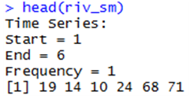
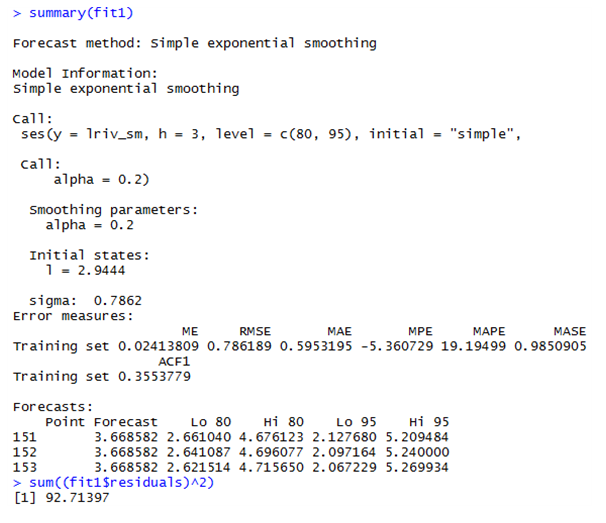
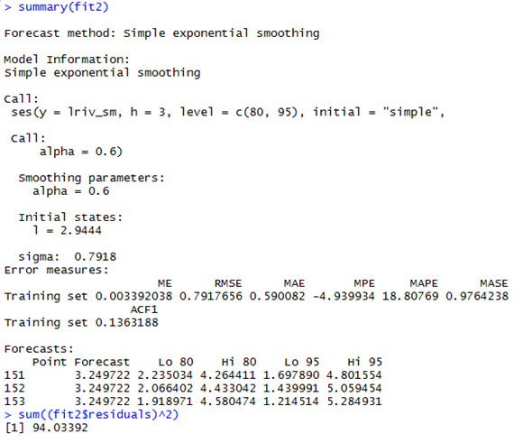
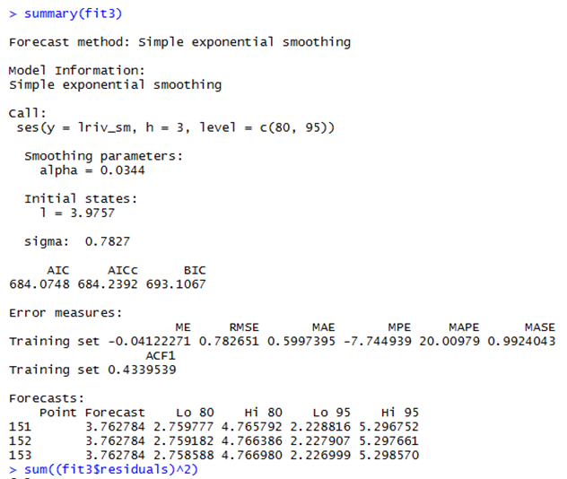

# 평활법

## 준비
```r
library(forecast)
library(lmtest)
riv_sm <- read.csv("C:/Users/CBNU/Desktop/gota-river-near-sjotopvannersbur.csv",header=T)
riv_sm <- riv_sm[,2]
riv_sm <- riv_sm[-151]
riv_sm <- riv_sm[-151]
riv_sm <- ts(riv_sm)
head(riv_sm)
```

- 추세나 계절성을 띄지 않아 최근의 자료들에 대해 더 많은 가중치를 부여하는 단순지수 평활법을 사용한다.
```r
lriv <- log(riv_sm)
plot.ts(lriv_sm,main="plot for log(riv)")
```
.PNG)

## 분석
- 0에서 1 사이의 값을 갖는 가중치의 역할을 하는 평활상수 α를 0.2로 놓았을 때의 그래프는 다음과 같이 나타난다.   
이 그래프를 보아 자료가 비교적 안정적이지 못하고, 변동이 심한 것을 보아 α의 값이 더 커야함을 알 수 있다.
```r
fit1 <- ses(lriv_sm, h=3, level=c(80,95),initial="simple", alpha=0.2)
fit2 <- ses(lriv_sm, h=3, level=c(80,95),initial="simple", alpha=0.6)
fit3 <- ses(lriv_sm, h=3, level=c(80,95))
plot(fit1, ylab="Balance on current account(million dollar)",xlab="Year"
     , main="", fcol="white",type="o")
lines(fitted(fit1),col="blue", type="o",pch=2)
```
.PNG)
- 이제 다음과 같이 모든 데이터들이 단순지수평활법으로 적합되는 fitted함수를 이용하여 lines를 추가하고, 가중치의 역할을 하는 평활상수 α에 따라 그래프가 어떻게 변하는지 살펴보자.
- 하단 좌측에 범례 삽입
```r
lines(fitted(fit2),col="red", type="o",pch=3)
lines(fitted(fit3),col="green", type="o",pch=5)
lines(fit1$mean,col="green", type="o",pch=5)
lines(fit2$mean,col="red", type="o",pch=3)
lines(fit3$mean,col="green", type="o",pch=5)
legend("bottomleft",lty=1,pch=c(1,2,3,5),col=c(1,"blue","red","green"),
       c("data",expression(alpha==0.2),expression(alpha==0.6),
         expression(alpha==0.99)))
```
_add_lines.PNG)
- 이 그래프를 통해 α=0.2, α=0.6 , α=0.99 일 때 적합 되는 그래프를 확인해본 결과 가중치가 1에 가까워지며 커질수록 폭이 좁아지고, 최근의 자료에 얼마나 가중치를 주는가에 따라서 미래에 대한 예측값도 변하는 것을 알 수 있다.

- summary(fit _ )와 sum((fit _ $residuals)^2)를 통해 예측오차의 제곱합을 알아보았다.
```r
summary(fit1)
sum((fit1$residuals)^2)
```

```r
summary(fit2)
sum((fit2$residuals)^2)
```

```r
summary(fit3)
sum((fit3$residuals)^2)
```


- 위에서 확인할 수 있듯이 예측오차의 제곱합을 최소로 하는 α를 결정하는데에 있어서   fit1은 92.71397, fit2는 94.03392, fit3는 91.8814   가 나왔으며 예측오차의 제곱합이 최소가 되는 α는 0.99이므로 fit3(α=0.99)를 선택할 수 있다.
