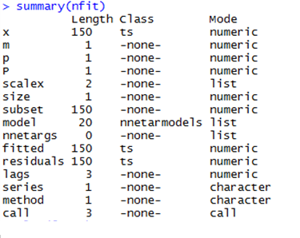
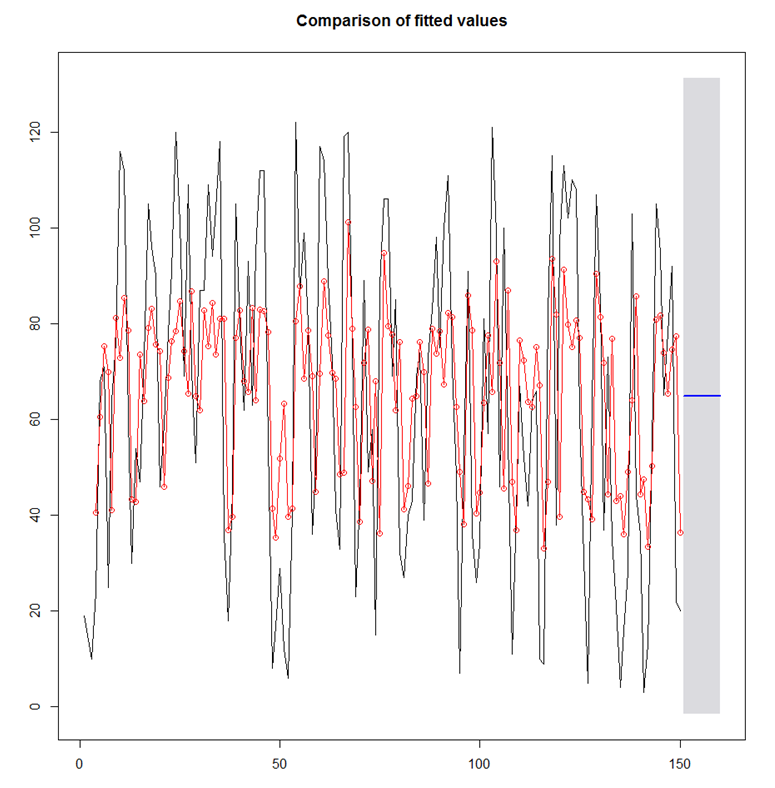
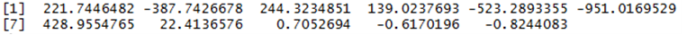

# 인공신경망

## 준비
```r
library(forecast)
nfit <- nnetar(riv,p=3)
h=10
test <- riv[((length(riv)-h)+1):length(riv)]
fcast <- forecast(nfit,h=h,level=0.95)
summary(nfit)
```
   
- NNAR(p,k) = ARIMA(p,0,0)   
여러값들을 넣으면서 최적의 차수를 찾아준다.
- 소문자 p 는 nonseasonal , 대문자 P 는 seasonal 일 때 차수 k=(p+P+1)/2  k는 은닉층 개수를 나타낸다.
```r
plot(fcast)
```
.PNG)   
- fcast의 평균값을 적합시킨 NNAR(3,2) 차수를 갖는 예측도

## 신경망 적용
```r
press.nn <- sum((test-as.vector(fcast$mean))^2)/h
press.nn
# > 1272.193
```
- 값이 작을수록 좋은 모형이다. (신경망이 더 좋은 모형)

## PLOT
```r
riv_1 <- riv
riv_1 <- forecast(riv_1,h=10,level=0.95)
plot(rov_1,col="black",type="l",lwd="l",main="Comparison of fitted values")
lines(fitted.values(nfit),type="o",col="red",pch=1)
```
   
- PLOT을 통해 예측값을 포함한 시계열도와 ANN(인공신경망) 그래프 비교
원래 데이터에 비해 폭이 좁아지지만, 비슷한 경향을 갖는 것을 알 수 있다.

### 가중치
```r
fcast$model[[1]]$wts
```

- fcast들의 가중치 값.